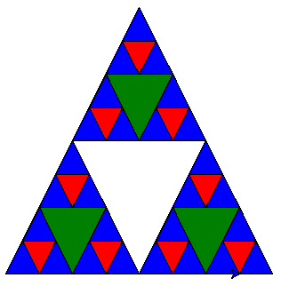

# Exercises

### 1. Draw a call stack for the Tower of Hanoi problem. Assume that you start with a stack of three disks.

<details>
<summary>Click to view answer</summary>

```
solve_toi(disks=[1, 2, 3],	from_pole='Pole A',	to_pole='Pole C',	intermediary_pole='Pole B')
solve_toi(disks=[1, 2],		from_pole='Pole A',	to_pole='Pole B',	intermediary_pole='Pole C')
solve_toi(disks=[1],		from_pole='Pole A',	to_pole='Pole C',	intermediary_pole='Pole B')
solve_toi(disks=[2],		from_pole='Pole A',	to_pole='Pole B',	intermediary_pole='Pole C')
solve_toi(disks=[1],		from_pole='Pole C',	to_pole='Pole B',	intermediary_pole='Pole A')
solve_toi(disks=[3],		from_pole='Pole A',	to_pole='Pole C',	intermediary_pole='Pole B')
solve_toi(disks=[1, 2],		from_pole='Pole B',	to_pole='Pole C',	intermediary_pole='Pole A')
solve_toi(disks=[1],		from_pole='Pole B',	to_pole='Pole A',	intermediary_pole='Pole C')
solve_toi(disks=[2],		from_pole='Pole B',	to_pole='Pole C',	intermediary_pole='Pole A')
solve_toi(disks=[1],		from_pole='Pole A',	to_pole='Pole C',	intermediary_pole='Pole B')
```
</details>

---

### 2. Using the recursive rules as described, draw a Sierpinski triangle using paper and pencil.

<details>
<summary>Click to view answer</summary>



</details>

---

### 3. Using the dynamic programming algorithm for making change, find the smallest number of coins that you can use to make 33 cents in change. In addition to the usual coins, assume that you have an 8-cent coin.

<details>
<summary>Click to view answer</summary>

Check out the [code](./coinChange.py).

Answer: (2, [8, 25])

</details>

---

### 4. Write a recursive function to compute the factorial of a number.
#### [Code](./factorial.py)

---

### 5. Write a recursive function to reverse a list.

<details>
<summary>Click to view answer</summary>

```python
def reverse(head: Node) -> Node:
    """Reverse the given singly linked list recursively."""
    if not head or not head.next:
        return head

    new_head = reverse(head.next)
    head.next.next = head
    head.next = None
    return new_head       

```

```python
def reverse(self, head: Node) -> Node:
    """Reverse the given doubly linked list recursively."""
    if not head: 
        return head

    if not head.next: 
        head.next, head.prev = head.prev, head.next
        return head

    new_head = self.reverse(head.next)
    head.next, head.prev = head.prev, head.next
    return new_head       
```

```python
def reverse(a_list: List[Any]) -> List[Any]: 
    """Reverse the given list recursively."""
    if len(a_list) == 1: 
        return a_list[0]
    else: 
        return reverse(a_list[1:]) + a_list[0]
```

</details>

---

### 6. Modify the recursive tree program using one or all of the following ideas:
- Modify the thickness of the branches so that as the `branch_len` gets smaller, the line gets thinner.
- Modify the color of the branches so that as the `branch_len` gets very short it is colored like a leaf.
- Modify the angle used in turning the turtle so that at each branch point the angle is selected at random in some range. For example, choose an angle between 15 and 45 degrees. Play around to see what looks good.
- Modify the `branch_len` recursively so that instead of always subtracting the same amount, you subtract a random amount in some range.

If you implement all of the above ideas you will have a very realistic looking tree.
#### [Code](./fractalTreeModified.py)

---

### 7. Find or invent an algorithm for drawing a fractal mountain. Hint: one approach to this uses triangles again.
#### [Code](./fractalMountain.py)

---

### 8. Write a recursive function to compute the Fibonacci sequence. How does the performance of the recursive function compare to that of an iterative version?
#### [Code](./fibonacci.py) for Fibonacci and [Code](./fibonacciComparison.py) for Fibonacci comparision

---

### 9. Implement a solution to the Tower of Hanoi using three stacks to keep track of the disks.

---

### 10. Using the turtle graphics module, write a recursive program to display a Hilbert curve.

---

### 11. Using the turtle graphics module, write a recursive program to display a Koch snowflake.
#### [Code](./kochSnowflake.py)
---

### 12. Write a program to solve the following problem. You have two jugs: a 4-gallon jug and a 3-gallon jug. Neither of the jugs has markings on them. There is a pump that can be used to fill the jugs with water. How can you get exactly two gallons of water in the 4-gallon jug?

---

### 13. Generalize the problem above so that the parameters to your solution include the sizes of each jug and the final amount of water to be left in the larger jug.

---

### 14. Write a program that solves the following problem. Three missionaries and three cannibals come to a river and find a boat that holds two people. Everyone must get across the river to continue on the journey. However, if the cannibals ever outnumber the missionaries on either bank, the missionaries will be eaten. Find a series of crossings that will get everyone safely to the other side of the river.

---

### 15. Modify the Tower of Hanoi program using turtle graphics to animate the movement of the disks. Hint: you can make multiple turtles and have them shaped like rectangles.

---

### 16. Pascal’s triangle is a number triangle with numbers arranged in staggered rows such that:

```
        1
      1   1
    1   2   1
  1   3   3   1
1   4   6   4   1
```

This is the equation for a binomial coefficient. You can build Pascal’s triangle by adding the two numbers that are diagonally above a number in the triangle. Write a program that prints out Pascal’s triangle. Your program should accept a parameter that tells how many rows of the triangle to print.

---

### 17. Knapsack problem (Dynamic Programming)  
Suppose you are a computer scientist/art thief who has broken into a major art gallery. All you have with you to haul out your stolen art is your knapsack which only holds a certain weight, but for every piece of art you know its value and its weight. Write a dynamic programming function to help you maximize your profit.

Here is a sample problem for you to get started:

Suppose your knapsack can hold a total weight of 20 pounds. You have 5 items as follows:

| Item | Weight | Value |
|------|--------|-------|
| 1    | 2      | 3     |
| 2    | 3      | 4     |
| 3    | 4      | 8     |
| 4    | 5      | 8     |
| 5    | 9      | 10    |

---

### 18. String edit distance problem (Dynamic Programming)  
This problem is useful in many areas of research. Suppose that you want to transform the word "algorithm" into the word "alligator". For each letter, you can either:
- Copy the letter from one word to another at a cost of 5.
- Delete a letter at a cost of 20.
- Insert a letter at a cost of 20.

The total cost to transform one word into another is used by spell-check programs to provide suggestions for words that are close to one another. Use dynamic programming techniques to develop an algorithm that gives you the smallest edit distance between any two words.

---
